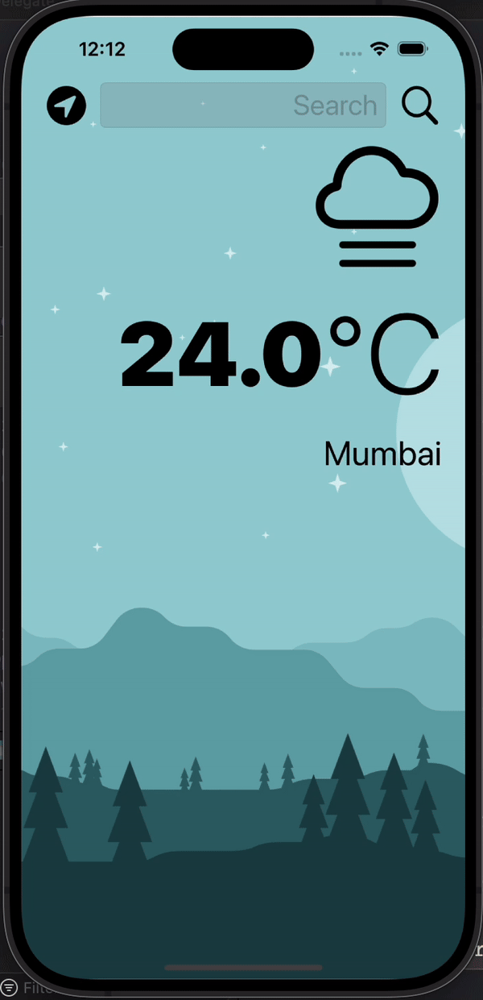

#  Clima

## Goal
Clima is a weather application designed to provide users with real-time weather updates based on their current location. With an intuitive user interface and seamless integration of GPS data and Core Location services, Clima ensures that users stay informed about the weather conditions in their vicinity. Key features of the app include:

## Real-Time Weather Updates: 
Clima fetches weather data from a reliable API, ensuring that users receive accurate and up-to-date information about current weather conditions.

## Location Services Integration: 
By leveraging GPS data and Core Location services, Clima automatically detects the user's current location, eliminating the need for manual input of location details.

## Intuitive User Interface: 
Clima offers a user-friendly interface that displays essential weather information in a clear and concise manner, allowing users to quickly access the data they need.

## Dark Theme Mode: 
Clima provides users with the option to switch between light and dark theme modes, catering to personal preferences and enhancing the app's usability in different lighting conditions.

